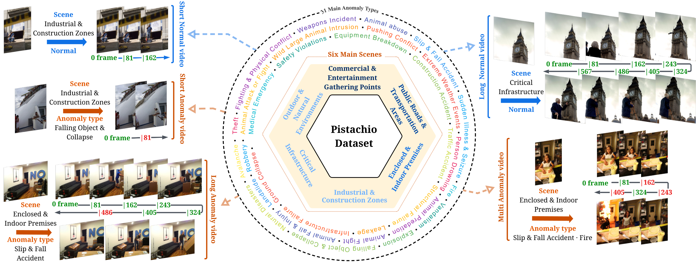

# Pistachio: Towards Synthetic, Balanced, and Long-Form Video Anomaly Benchmarks

[](https://arxiv.org/abs/2511.19474)
[](https://pistachio-video.github.io )
[](https://huggingface.co/datasets/lizirulestheworld/Pistachio)



## 📋 Installation
Clone the repo:
```sh
git clone https://github.com/Pistachio.git
cd Pistachio
```

## 🚀 Usage Guide

This project is divided into two main parts: the **Video Generation Pipeline** and the **Video Anomaly Detection (VAD) Method Testing**.

### 🎥 Video Generation Pipeline

If you wish to generate videos, please navigate to the `video_generation_pipeline` folder and check the **[README.md file inside](https://github.com/Lizruletheworld/Pistachio/blob/main/video_generation_pipeline/README.md)** for detailed instructions.

```sh
cd video_generation_pipeline
# Consult video_generation_pipeline/README.md for detailed video generation steps
```

### 🧠 Video Anomaly Detection (VAD) Method Testing

This repository includes testing scripts and necessary modifications for seven VAD methods. These methods are categorized based on their backbone network:

  * **I3D Backbone Methods**: Located in the `Pistachio/vad/i3d` directory.
  * **ViT Backbone Methods**: Located in the `Pistachio/vad/vit` directory.

**⚠️ Testing Procedure**

1.  **Clone the Original Repository**: For each method you want to test, first `git clone` the **original repository provided in the respective paper**.
2.  **Apply Modifications**: Apply the required file/folder changes or additions to your cloned repository based on the instructions provided in the corresponding subfolder within `Pistachio/vad/i3d` or `Pistachio/vad/vit`.

Below are the seven methods, their details, and placeholders for the execution code:

-----

### **Method List and Execution Code**

| Method Name         | Backbone | Pistachio Path                                            | Original Repository Link                                      |
|:--------------------|:---------|:----------------------------------------------------------|:--------------------------------------------------------------|
| **MGFN**            | I3D      | `Pistachio/vad/i3d/MGFN.-main]`                           | https://github.com/carolchenyx/MGFN.                          |
| **MULDE**           | I3D      | `Pistachio/vad/i3d/MULDE`                                 | https://github.com/divyanshm21/MULDE--Video-Anomaly-detection |
| **RTFM**            | I3D      | `Pistachio/vad/i3d/RTFM`                                  | https://github.com/tianyu0207/RTFM                            |
| **UR-DMU-master**   | I3D      | `Pistachio/vad/i3d/UR-DMU-master`                         | https://github.com/henrryzh1/UR-DMU                           |
| **CLIP-TSA**        | I3D/ViT  | `Pistachio/vad/i3d/CLIP-TSA` `Pistachio/vad/vit/CLIP-TSA` | https://github.com/joos2010kj/CLIP-TSA                        |
| **PEL4VAD**                | ViT      | `Pistachio/vad/vit/PEL4VAD`                               | https://github.com/yujiangpu20/PEL4VAD                        |
| **VadCLIP** | ViT      | `Pistachio/vad/vit/VadCLIP`                               | https://github.com/nwpu-zxr/VadCLIP                                                              |

-----

### **MGFN**

**Example Run Code**:

```sh
# Please fill in the code required to run this method (e.g., training and testing commands)
python main.py
```

-----

### **MULDE**

**Example Run Code**:

```sh
# Please fill in the code required to run this method
python main.py \
    --device cuda:0 \
    --batch_size 8192 \
    --beta 0.1 \
    --L 16 \
    --layernorm \
    --dropout 0.5
```

-----

### **RTFM**

**Example Run Code**:

```sh
# Please fill in the code required to run this method
python -m visdom.server
python main.py
```

-----

### **UR-DMU-master**

**Example Run Code**:

```sh
# Please fill in the code required to run this method
python pistachio_main.py
python pistachio_infer.py
```

-----

### **CLIP-TSA**

**Example Run Code**:

```sh
# Please fill in the code required to run this method
python main.py --dataset 'pistachio' --visual i3d --gpu 0
python main.py --dataset 'pistachio' --visual vit --gpu 0
```

-----

### **PEL4VAD**

**Example Run Code**:

```sh
# Please fill in the code required to run this method
python main.py --dataset 'pistachio' --mode 'train'  
python main.py --dataset 'pistachio' --mode 'infer'  
```

-----

### **VadCLIP**

**Example Run Code**:

```sh
# Please fill in the code required to run this method
python src/pistachio_train.py
python src/pistachio_test.py
```

-----

## 🏆 Scores

Below shows the performance scores (AUR, AP) obtained by various methods on the Pistachio benchmark.
| Method | Year | Backbone | Overall AUC (%) | Overall AP (%) |
| :--- | :--- | :--- | :---: | :---: |
| RTFM | 2021 | I3D | 82.9 | 69.3 |
| DR-DMU | 2023 | I3D | 81.5 | **71.5** |
| MGFN | 2023 | I3D | 74.9 | 50.2 |
| CLIP-TSA | 2023 | I3D | 76.86 | 55.15 |
| CLIP-TSA | 2023 | ViT | 80.91 | 57.3 |
| MULDE | 2024 | I3D | 63.4 | 34.9 |
| VadCLIP | 2024 | ViT | 78.06 | 64.13 |
| PEL4VAD | 2024 | ViT | **83.7** | 70.96 |

-----

## Citation

If you use Pistachio in your research, please cite:

```bibtex
@misc{li2025pistachiosyntheticbalancedlongform,
      title={Pistachio: Towards Synthetic, Balanced, and Long-Form Video Anomaly Benchmarks}, 
      author={Jie Li and Hongyi Cai and Mingkang Dong and Muxin Pu and Shan You and Fei Wang and Tao Huang},
      year={2025},
      eprint={2511.19474},
      archivePrefix={arXiv},
      primaryClass={cs.CV},
      url={https://arxiv.org/abs/2511.19474}
}
```
