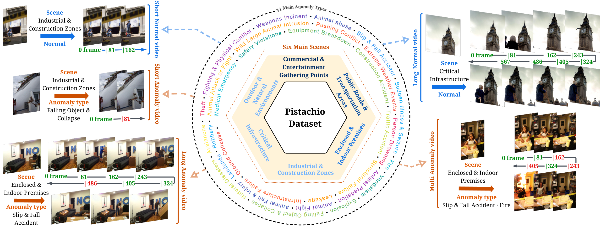

<h1 align="center">Pistachio: Towards Synthetic, Balanced, and Long-Form Video Anomaly Benchmarks</h1>

<p align="center"><b>ECCV 2026</b></p>

<p align="center">
  Jie Li<sup>*</sup> ·
  Hongyi Cai<sup>*</sup> ·
  Mingkang Dong ·
  Muxin Pu ·
  Shan You ·
  Fei Wang ·
  Tao Huang<sup>†</sup>
</p>


<p align="center">
  <a href="https://arxiv.org/abs/2511.19474">
    
  </a>
  <a href="https://pistachio-video.github.io">
    
  </a>
  <a href="https://huggingface.co/datasets/lizirulestheworld/Pistachio">
    
  </a>
</p>




## 📋 Installation
Clone the repo:
```sh
git clone https://github.com/Pistachio.git
cd Pistachio
```

## 🚀 Usage Guide

This project is divided into two main parts: the **Video Generation Pipeline** and the **Video Anomaly Detection (VAD) Method Testing**.

### 🎥 Video Generation Pipeline

If you wish to generate videos, please navigate to the `video_generation_pipeline` folder and check the **[README.md](https://github.com/Lizruletheworld/Pistachio/blob/main/video_generation_pipeline/README.md)** for detailed instructions.

```sh
cd video_generation_pipeline
# Consult video_generation_pipeline/README.md for detailed video generation steps
```

### 🧠 Video Anomaly Detection (VAD) Method Testing

This repository includes testing scripts and necessary modifications for nine VAD methods. These methods are categorized based on their backbone network:

  * **I3D Backbone Methods**: Located in the `Pistachio/vad/i3d` directory.
  * **ViT Backbone Methods**: Located in the `Pistachio/vad/vit` directory.
  * **Training-free / VLM Methods**: Located in the `Pistachio/vad/training-free` directory.

Before running the VAD adapters, set `PISTACHIO_DATASET_ROOT` to your `Pistachio_dataset` directory and regenerate method lists with `python Pistachio/vad/prepare_pistachio_lists.py`. See `Pistachio/vad/README.md` for details, including MULDE preprocessing.

**VAD adapter workflow**

The VAD folders are adapters for the original method repositories. For a clean customer setup:

1. Download the dataset archives from Hugging Face: https://huggingface.co/datasets/lizirulestheworld/Pistachio
2. Extract the archives into one directory so that it contains `VAD/` and/or `VAU/`.
3. Clone this Pistachio code repository.
4. Set `PISTACHIO_DATASET_ROOT` to the extracted dataset directory.
5. Run `python Pistachio/vad/prepare_pistachio_lists.py --dataset-root "$PISTACHIO_DATASET_ROOT"`.
6. Clone the original method repository.
7. Copy the matching adapter folder from `Pistachio/vad/...` into the cloned method repository.
8. Run the method from that cloned repository.

The adapter workflow was smoke-tested for data loading, path resolution, and selected lightweight forward/path checks. Full training or full VLM inference to final benchmark metrics is not part of the smoke test. See `Pistachio/vad/README.md` for the exact clone URLs, copy commands, environment notes, MULDE preprocessing, Fed-WSVAD checks, and VADTree scope.

Below are the nine methods and their adapter paths:

-----

### **Method List**

| Method Name         | Backbone | Pistachio Path                                            | Original Repository Link                                      |
|:--------------------|:---------|:----------------------------------------------------------|:--------------------------------------------------------------|
| **MGFN**            | I3D      | `Pistachio/vad/i3d/MGFN.-main`                           | https://github.com/carolchenyx/MGFN.                          |
| **MULDE**           | I3D      | `Pistachio/vad/i3d/MULDE`                                 | https://github.com/divyanshm21/MULDE--Video-Anomaly-detection |
| **RTFM**            | I3D      | `Pistachio/vad/i3d/RTFM`                                  | https://github.com/tianyu0207/RTFM                            |
| **UR-DMU-master**   | I3D      | `Pistachio/vad/i3d/UR-DMU-master`                         | https://github.com/henrryzh1/UR-DMU                           |
| **CLIP-TSA**        | I3D/ViT  | `Pistachio/vad/i3d/CLIP-TSA` `Pistachio/vad/vit/CLIP-TSA` | https://github.com/joos2010kj/CLIP-TSA                        |
| **PEL4VAD**                | ViT      | `Pistachio/vad/vit/PEL4VAD`                               | https://github.com/yujiangpu20/PEL4VAD                        |
| **VadCLIP** | ViT      | `Pistachio/vad/vit/VadCLIP`                               | https://github.com/nwpu-zxr/VadCLIP                                                              |
| **Fed-WSVAD**       | ViT      | `Pistachio/vad/vit/Fed-WSVAD`                             | https://github.com/wbfwonderful/Fed-WSVAD                    |
| **VADTree**         | VLM / training-free | `Pistachio/vad/training-free/VADTree`             | https://github.com/wenlongli10/VADTree                       |

-----

### **MGFN**

**Example Run Code**:

```sh
# Please fill in the code required to run this method (e.g., training and testing commands)
python main.py
```

-----

### **MULDE**

**Example Run Code**:

```sh
# Please fill in the code required to run this method
python main.py \
    --device cuda:0 \
    --batch_size 8192 \
    --beta 0.1 \
    --L 16 \
    --layernorm \
    --dropout 0.5
```

-----

### **RTFM**

**Example Run Code**:

```sh
# Please fill in the code required to run this method
python -m visdom.server
python main.py
```

-----

### **UR-DMU-master**

**Example Run Code**:

```sh
# Please fill in the code required to run this method
python pistachio_main.py
python pistachio_infer.py
```

-----

### **CLIP-TSA**

**Example Run Code**:

```sh
# Please fill in the code required to run this method
python main.py --dataset 'pistachio' --visual i3d --gpu 0
python main.py --dataset 'pistachio' --visual vit --gpu 0
```

-----

### **PEL4VAD**

**Example Run Code**:

```sh
# Please fill in the code required to run this method
python main.py --dataset 'pistachio' --mode 'train'  
python main.py --dataset 'pistachio' --mode 'infer'  
```

-----

### **VadCLIP**

**Example Run Code**:

```sh
# Please fill in the code required to run this method
python src/pistachio_train.py
python src/pistachio_test.py
```

-----

### **Fed-WSVAD**

**Example Run Code**:

```sh
python train.py --dataset me --split_mode event --batch_size 64 --clients_num 32
python inference.py --dataset me --checkpoint /path/to/model.pth
```

-----

### **VADTree**

VADTree is a training-free VLM pipeline. The Pistachio adapter provides annotations, nested video path resolution, and patched scripts; external model checkpoints and generated intermediate JSON files are not included. See `vad/training-free/VADTree/README.md`.

```sh
export PISTACHIO_DATASET_ROOT=/path/to/Pistachio_dataset
python EfficientGEBD/GEBD_split100.py \
  --video_dir "$PISTACHIO_DATASET_ROOT/VAD/video/test" \
  --annotationfile_path dataset_info/Pistachio/annotations/pistachio_anomaly_test.txt \
  --config-file /path/to/baseline.yaml \
  --resume /path/to/model_best.pth
```

-----

## 🏆 Scores

Below shows the performance scores (AUR, AP) obtained by various methods on the Pistachio benchmark.
| Method | Year | Backbone | Overall AUC (%) | Overall AP (%) |
| :--- | :--- | :--- | :---: | :---: |
| RTFM | 2021 | I3D | 82.9 | 69.3 |
| DR-DMU | 2023 | I3D | 81.5 | **71.5** |
| MGFN | 2023 | I3D | 74.9 | 50.2 |
| CLIP-TSA | 2023 | I3D | 76.86 | 55.15 |
| CLIP-TSA | 2023 | ViT | 80.91 | 57.3 |
| MULDE | 2024 | I3D | 63.4 | 34.9 |
| VadCLIP | 2024 | ViT | 78.06 | 64.13 |
| PEL4VAD | 2024 | ViT | **83.7** | 70.96 |
| Fed-WSVAD | 2025 | ViT | 83.2 | 71.9 |
| VADTree | 2026 | - | 72.52 | 25.15 |

-----

## Citation

If you use Pistachio in your research, please cite:

```bibtex
@misc{li2025pistachiosyntheticbalancedlongform,
      title={Pistachio: Towards Synthetic, Balanced, and Long-Form Video Anomaly Benchmarks}, 
      author={Jie Li and Hongyi Cai and Mingkang Dong and Muxin Pu and Shan You and Fei Wang and Tao Huang},
      year={2025},
      eprint={2511.19474},
      archivePrefix={arXiv},
      primaryClass={cs.CV},
      url={https://arxiv.org/abs/2511.19474}
}
```
